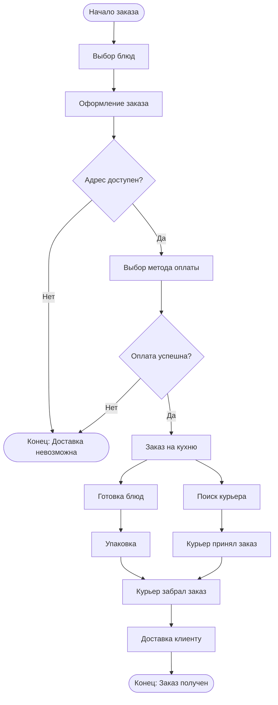

```mermaid
flowchart TD
    Start([Начало заказа]) --> Choose[Выбор блюд]
    Choose --> Checkout[Оформление заказа]
    Checkout --> CheckAddr{Адрес доступен?}
    
    CheckAddr -- Нет --> EndFail([Конец: Доставка невозможна])
    CheckAddr -- Да --> SelectPay[Выбор метода оплаты]
    
    SelectPay --> ProcessPay{Оплата успешна?}
    ProcessPay -- Нет --> EndFail
    ProcessPay -- Да --> Kitchen[Заказ на кухню]
    
    Kitchen --> Prepare[Готовка блюд]
    Kitchen --> FindCourier[Поиск курьера]
    
    Prepare --> Pack[Упаковка]
    FindCourier --> Accept[Курьер принял заказ]
    
    Pack --> Take[Курьер забрал заказ]
    Accept --> Take
    
    Take --> Deliver[Доставка клиенту]
    Deliver --> Done([Конец: Заказ получен])
```