# Отчёт по лабораторной работе №2. Node-RED

## 1. Среда развертывания и версии

* **Способ установки:** Docker Desktop (официальный образ `nodered/node-red:latest`, монтирование volume `/data`, проброс порта `1880:1880`).
* **Версии ПО (из логов контейнера):**
  * **Node-RED:** `v5.0.7` 
  * **Node.js:** `v24.20.0`
* **Доступ к интерфейсу:** через веб-браузер по адресу `http://localhost:1880`.

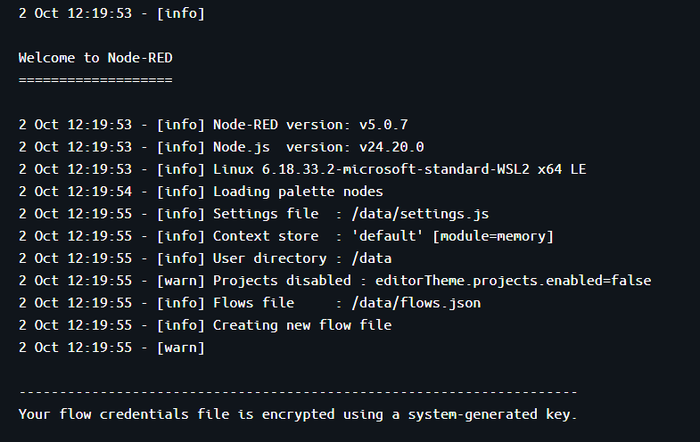

---

## 2. Краткое описание выполненной работы

В ходе работы освоена low-code платформа **Node-RED**, собраны и задеплоены потоки для различных сценариев обработки данных:
1. **Базовые потоки и преобразования:** работа с генерацией сообщений (`inject`), отладкой (`debug`), программированием JS-логики (`function`), маршрутизацией по условиям (`switch`), мутацией свойств (`change`) и генерацией текста через Mustache (`template`).
2. **Сетевые протоколы и API:** 
   * Получение данных из внешнего публичного REST API (`http request`).
   * Реализация асинхронной Pub/Sub модели через интернет-брокер HiveMQ (`mqtt in/out`).
   * Разработка собственного HTTP REST API с тремя GET-эндпоинтами (`/api/text`, `/api/info`, `/api/items/:id`) с валидацией входных параметров и кодами `200`, `400`, `404`.
3. **Пользовательский интерфейс и сервисы:**
   * Построение веб-дашборда с динамическими индикаторами `gauge` и графиком истории `chart` (`node-red-dashboard`).
   * Создание и интеграция Telegram-бота с обработкой команд `/start`, `/info` и эхо-ответом (`node-red-contrib-telegrambot`).
4. **Хранилище данных и контекст:**
   * Персистентная запись и чтение файла `data.json` на диск контейнера (`file in/out`).
   * Управление состоянием между вызовами через `flow context` (счётчик кликов с возможностью сброса).
5. **Ачивка 14 (WebSocket $\rightarrow$ Dashboard):** подключение к живому WebSocket-потоку биржи Binance и отображение котировок BTC/USDT в реальном времени.

---

## 3. Использование AI (ИИ-ассистента)

Искусственный интеллект применялся в качестве инструмента инженерного ассистирования для минимизации рутинных механических операций: генерации декларативных JSON-структур узлов, шаблонизации конфигураций и подготовки каркасов функций валидации. Архитектурная увязка блоков, развертывание в Docker и отладка сетевых взаимодействий осуществлялись вручную.

**Ключевые примеры промптов:**
* *«Сгенерируй конфигурацию трёх изолированных GET-эндпоинтов для Node-RED с валидацией path-параметра и возвратом кодов 400 и 404»*
* *«Напиши логику счетчика для Function node с сохранением состояния в flow context и возможностью сброса»*
* *«Сформируй JSON-схему для подключения к публичному WebSocket Binance (BTC ticker) и вывода данных на Dashboard»*
* *«Составь список ключевых примеров промптов, которые я использовал в этой работе, чтобы вставить их в отчёт» 

---

## 4. Освоенные узлы (Nodes)

* **Базовые:** `inject`, `debug`, `function`, `switch`, `change`, `template`.
* **Сетевые и Web:** `http in`, `http response`, `http request`, `mqtt in`, `mqtt out`, `websocket in`.
* **Интерфейс и интеграции:** `ui_gauge`, `ui_chart`, `ui_text`, `telegram receiver`, `telegram sender`.
* **Хранилище и контекст:** `file`, `file in`, контекстное хранилище `flow.get()` / `flow.set()`.

---

## 5. Скриншоты выполненных потоков

| Задание | Скриншот потока |
| :--- | :--- |
| **2.1. Inject $\rightarrow$ Debug** | 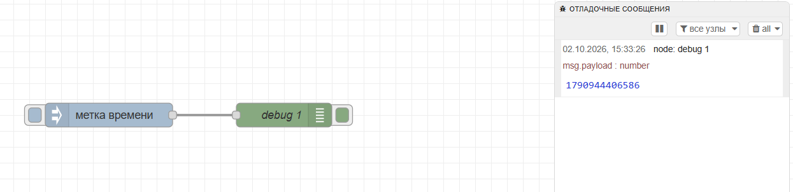 |
| **2.2. Function node** | 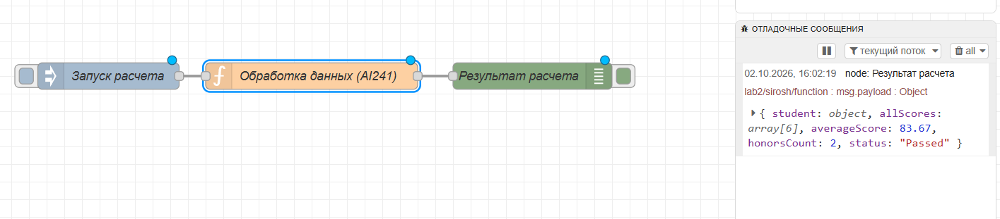 |
| **2.3. Switch node** | 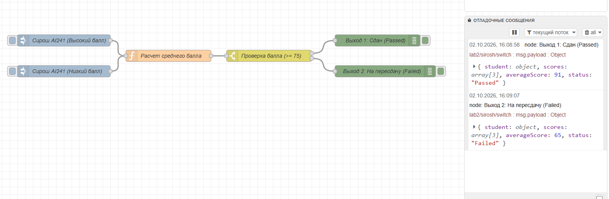 |
| **2.4. Change / Set node** | 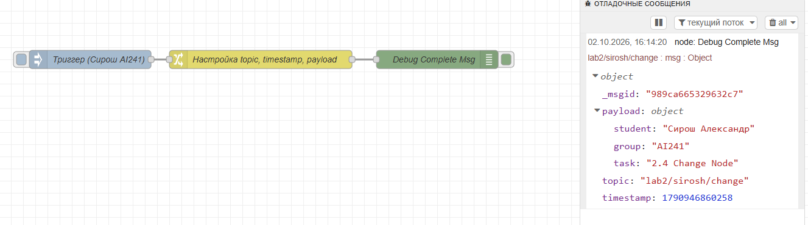 |
| **2.5. Template node** | 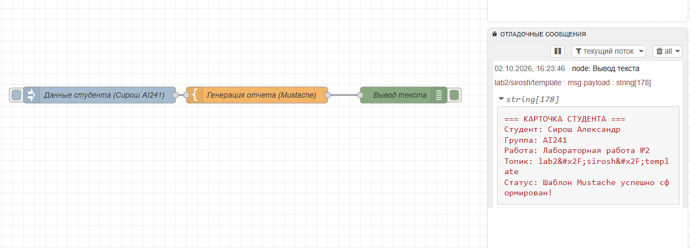 |
| **2.6. HTTP Request** | 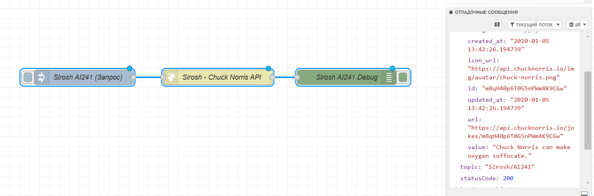 |
| **2.7. MQTT брокер** | 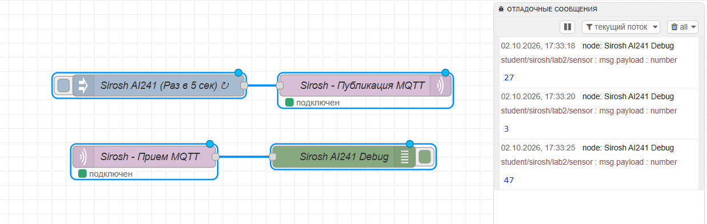 |
| **2.8. GET-эндпоинты (Схема)** | 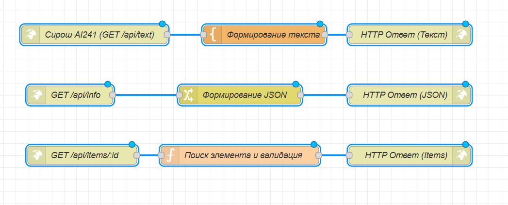 |
| **2.8. GET /api/text** | 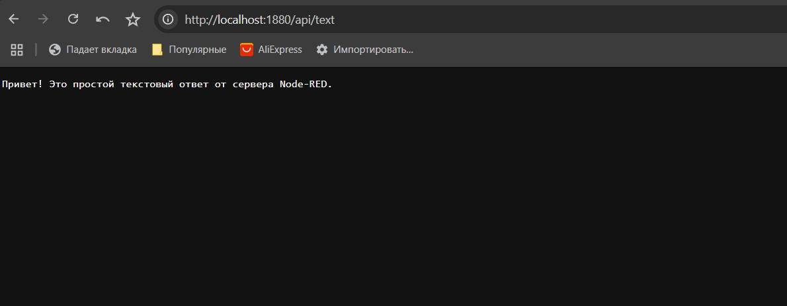 |
| **2.8. GET /api/info** | 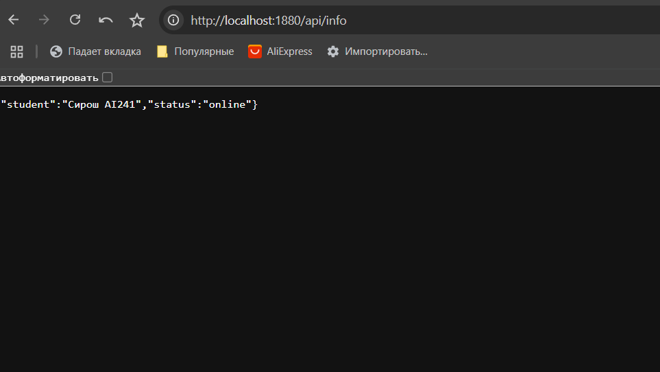 |
| **2.8. GET /api/items/1 (200 OK)** | 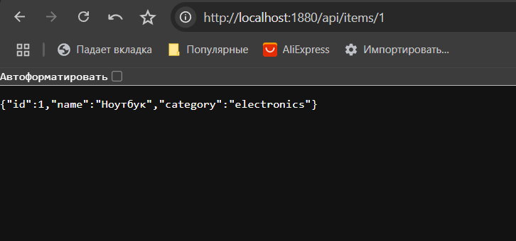 |
| **2.8. GET Ошибки (400 / 404)** | 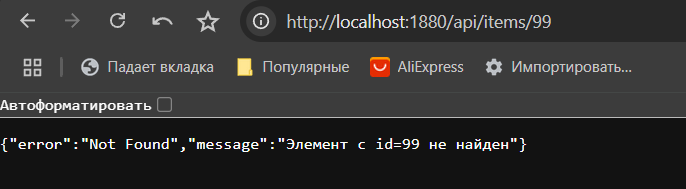 |
| **2.9. Dashboard (Gauge + Chart)**| 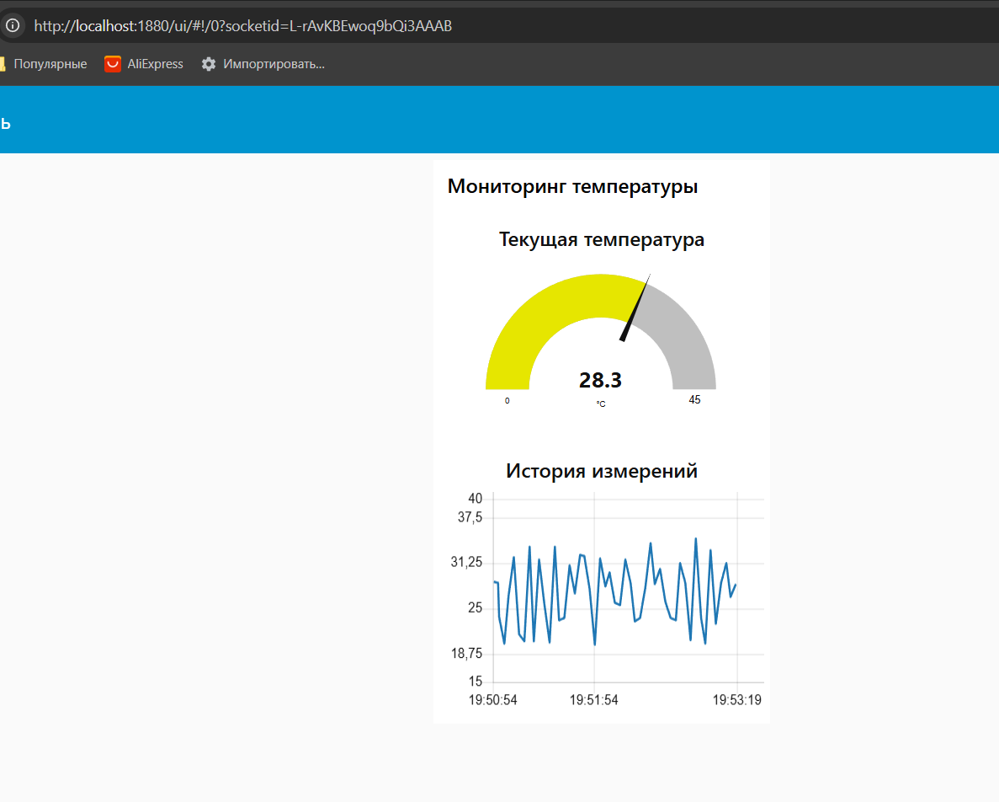 |
| **2.10. Telegram-бот** | 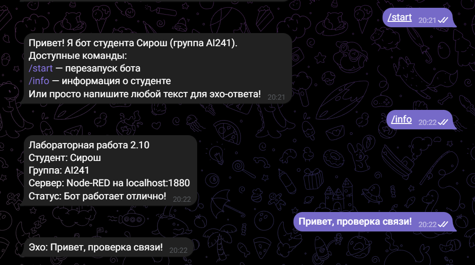 |
| **2.11. Чтение/запись файла** | 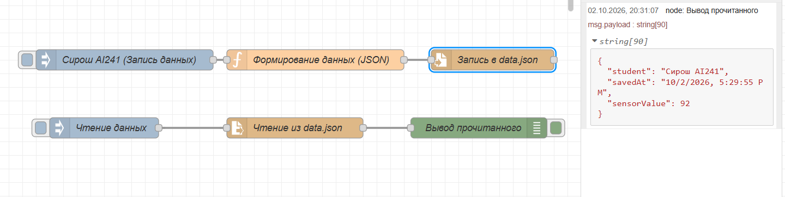 |
| **2.12. Flow context** | 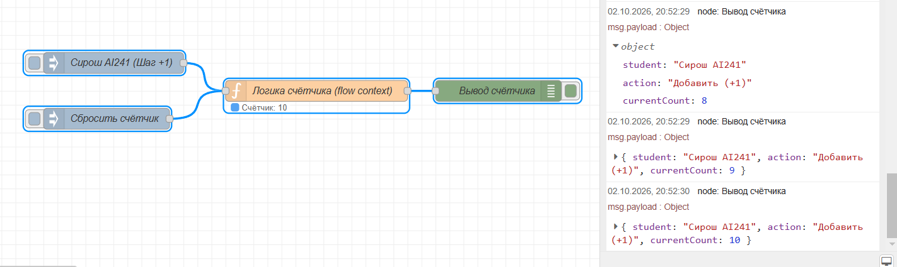 |
| **Ачивка 14. WebSocket Binance** | 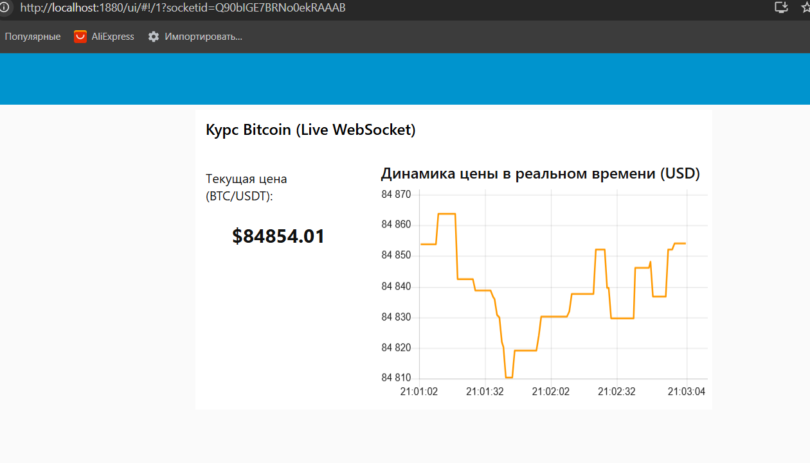 |

---

## 6. Вывод

[В ходе лабораторной работы понял, как удобно работать с визуальным программированием, где большая часть того, что я должен был бы прописывать вручную, заполняется и связывается автоматически. Также через решение совершенно разных типов задач (от брокеров сообщений и Telegram-ботов до работы с файлами и живыми WebSocket-потоками) убедился, что такой подход действительно универсален для быстрой разработки.]